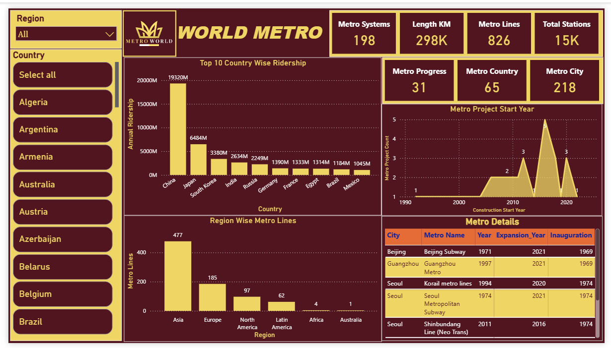
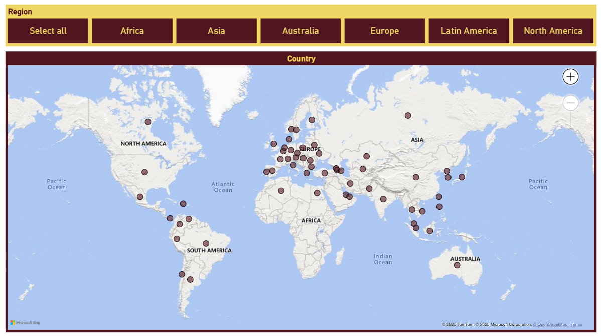
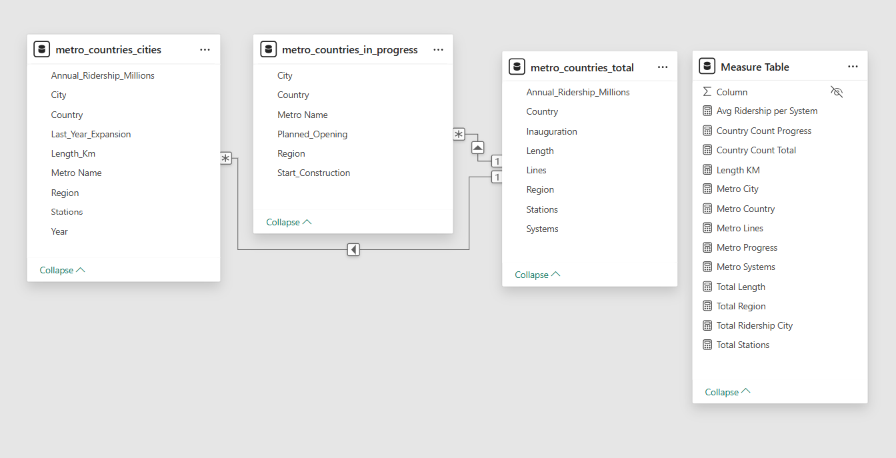

# World Metro Power_BI

<a href="https://www.kaggle.com/datasets/timmofeyy/-world-metro" target="_blank">Dataset</a>

✨ **Overview**

This dashboard visualizes global metro systems using Power BI, providing insights into metro system, length km, metro lines, station counts etc worldwide. The dataset includes key metrics such as ridership count, number of metro lines, stations, and ongoing metro projects for major metro systems across different countries and region. The Power BI dashboard enables users to explore metro data interactively through maps, charts, and filters, facilitating comparative analysis of metro infrastructure globally.

🔍 **Features**  
- Region and Country filters to customize data view.
- Top 10 Ridership count visualization over country.
- Key metrics: Metro Systems Count, Length KM, Metro Lines, Total Stations, Metro Progress Count, Metro Country Count, Metro City Count.
- Metro Project Count over construction start year.
- Metro Details Table.
- Map has been created to present Dashboard Details data according to Region to specific Regional Manager.
- Also created a tooltip for Country wise Ridership Count Bar Chart.

📊 **Data Highlights**  
- 📈 China has the most number of passangers using metro.
- 🚧 The most number of ongoing Metro Project started between year 2010 to 2022.
- 🌍 Asia is the region having most number of metro lines. 

⚙️ **Usage**  
- Use filters to select Region and Country dashboard updates dynamically.
- Use Map filters to present data according to the Region to the Regional Manager.

🧹 **Data Cleaning & Preparation**  
- Removed duplicate records to ensure data accuracy.
- Created some connections in the data model.
- Changed type of some data columns and also rounded the values etc.
- Created Measure Table and used some DAX formula like SUM, UNION and DIVIDE to find Total Count etc.

## Sample Dashboards

&nbsp;

&nbsp;

&nbsp;
